Endpoint : https://sparql.rhea-db.org/sparql

## Q1 : Retrieve all Rhea reactions (approved or preliminary) and display their chemical equation

```sparql
PREFIX rh:<http://rdf.rhea-db.org/>

SELECT ?reaction ?reactionEquation
WHERE {
VALUES ?status { rh:Approved rh:Preliminary }
    ?reaction rdfs:subClassOf rh:Reaction .
    ?reaction rh:status ?status .    
    ?reaction rh:equation ?reactionEquation .
}
ORDER BY ?reaction
```

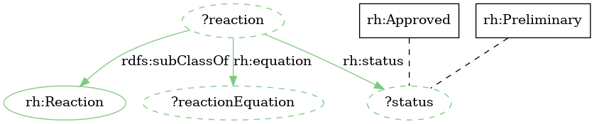

## Q2 : Retrieve all approved reactions using L-glutamate (CHEBI:29985) AND L-glutamine (CHEBI:58359) in opposite reaction sides

```sparql
PREFIX rh:<http://rdf.rhea-db.org/>
PREFIX ch:<http://purl.obolibrary.org/obo/>
SELECT ?reaction
WHERE {
	?reaction rdfs:subClassOf rh:Reaction .
	?reaction rh:status rh:Approved .
	?reaction rh:side ?reactionSide1 .
	?reactionSide1 rh:contains ?participant1 .
	?participant1 rh:compound ?compound1 .
	?compound1 rh:chebi ch:CHEBI_29985 .
	?reaction rh:side ?reactionSide2 .
	?reactionSide2 rh:contains ?participant2 .
	?participant2 rh:compound ?compound2 .
	?compound2 rh:chebi ch:CHEBI_58359 .
	?reactionSide1 rh:transformableTo ?reactionSide2 .
}
```

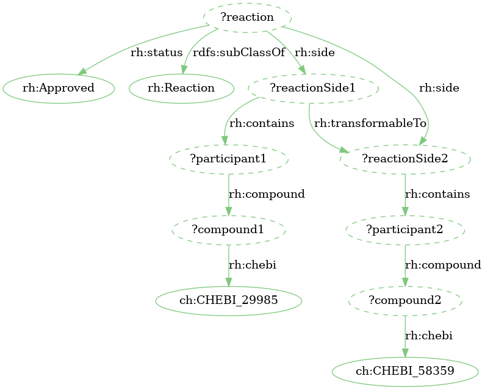

## Q3 : Select all approved reactions with CHEBI:17815 (a 1,2-diacyl-sn-glycerol) or one of its descendant

```sparql
PREFIX rh:<http://rdf.rhea-db.org/>
PREFIX ch:<http://purl.obolibrary.org/obo/>
PREFIX up:<http://purl.uniprot.org/core/>

SELECT distinct ?chebi ?chebiUniprotName ?reaction ?reactionEquation
WHERE {
	?reaction rdfs:subClassOf rh:Reaction .
	?reaction rh:status rh:Approved .
	?reaction rh:equation ?reactionEquation .
	?reaction rh:side ?reactionSide .
	?reactionSide rh:contains ?participant .
	?participant rh:compound ?compound .
	?compound rh:chebi ?chebi .
	?chebi rdfs:subClassOf* ch:CHEBI_17815 .
	?chebi up:name ?chebiUniprotName .
}
```

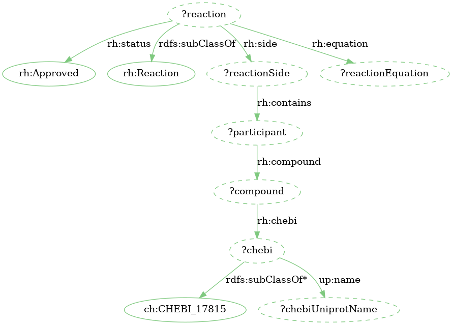

## Q4 : Retrieve Rhea reactions that involve cholesterol using its InChiKey

```sparql
PREFIX rh:<http://rdf.rhea-db.org/>
PREFIX ch:<http://purl.obolibrary.org/obo/>
PREFIX ch3:<http://purl.obolibrary.org/obo/chebi/>
PREFIX up:<http://purl.uniprot.org/core/>

SELECT distinct ?chebi ?chebiUniprotName ?reaction ?reactionEquation
WHERE {
    ?reaction rdfs:subClassOf rh:Reaction .
    ?reaction rh:status ?status .
    VALUES (?status) {(rh:Approved) (rh:Preliminary)}
    ?reaction rh:equation ?reactionEquation .
    ?reaction rh:side ?reactionSide .
    ?reactionSide rh:contains ?participant .
    ?participant rh:compound ?compound .
    ?compound rh:chebi ?chebi .
    ?chebi up:name ?chebiUniprotName .
    ?chebi ch3:inchikey ?inchikey .
    VALUES (?inchikey) {("HVYWMOMLDIMFJA-DPAQBDIFSA-N")}
}
ORDER BY ?reaction
```

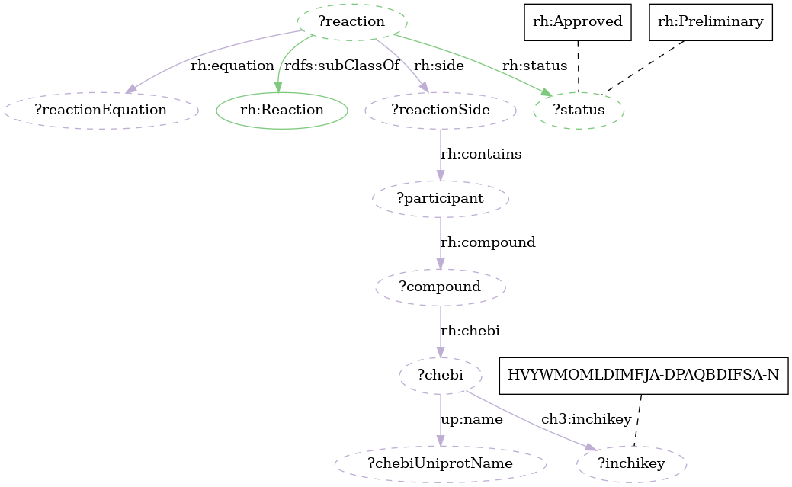

## Q5 : Distribution of Rhea reactions based on the first level of IUBMB enzyme classification

```sparql
PREFIX rh:<http://rdf.rhea-db.org/>
PREFIX ch:<http://purl.obolibrary.org/obo/>
PREFIX ec:<http://purl.uniprot.org/enzyme/>
PREFIX skos:<http://www.w3.org/2004/02/skos/core#>

SELECT ?ecClass
?ecClassName
(count(?reaction) as ?reactionCount)
WHERE
{
    SERVICE <http://sparql.uniprot.org/sparql> {
        ?ec rdfs:subClassOf ?ecClass .
        ?ecClass skos:prefLabel ?ecClassName .
        VALUES (?ecClass) { (ec:1.-.-.-) (ec:2.-.-.-)(ec:3.-.-.-)
        (ec:4.-.-.-)(ec:5.-.-.-) (ec:6.-.-.-)
        (ec:7.-.-.-) }
    }
    ?reaction rh:ec ?ec .
}
ORDER BY ?ecClass
```

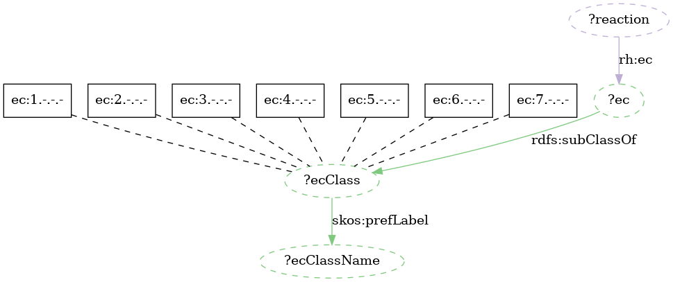

## Q6 : Retrieve human enzyme metabolizing cholesterol and their reactions

```sparql
PREFIX rdfs: <http://www.w3.org/2000/01/rdf-schema#>
PREFIX up: <http://purl.uniprot.org/core/>
PREFIX taxon:<http://purl.uniprot.org/taxonomy/>
PREFIX rh: <http://rdf.rhea-db.org/>
PREFIX ch:<http://purl.obolibrary.org/obo/>

SELECT DISTINCT ?protein ?proteinId ?proteinName
?reaction ?reactionEquation
WHERE {
    ?reaction rdfs:subClassOf rh:Reaction .
    ?reaction rh:side ?reactionSide .
    ?reactionSide rh:contains ?participant .
    ?participant rh:compound ?compound .
    # cholesterol (CHEBI:16113)
    ?compound rh:chebi ch:CHEBI_16113 .
    ?reaction rh:equation ?reactionEquation .
    
    SERVICE <https://sparql.uniprot.org/sparql/> {
        ?protein up:mnemonic ?proteinId .
        ?protein up:recommendedName ?rn .
        ?rn up:fullName ?proteinName .
        # HUMAN proteins (taxid=9606)
        ?protein up:organism taxon:9606 .
        ?protein up:annotation ?a1 .
        ?a1 a up:Catalytic_Activity_Annotation .
        ?a1 up:catalyticActivity ?ca .
        ?ca up:catalyzedReaction ?reaction .
    }
}
```

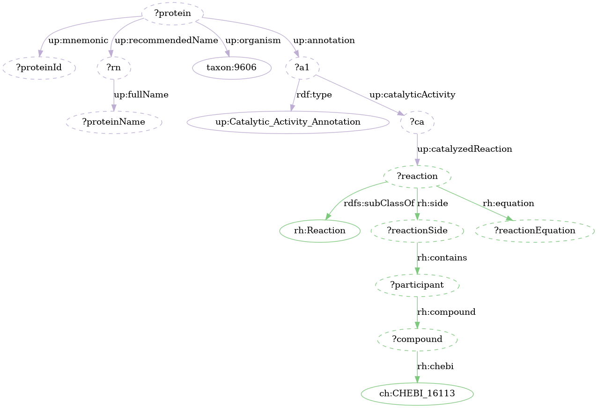

## Q7 : Ask if there are fungal UniProtKB/Swiss-Prot protein(s) metabolizing cholesterol (for QC)

```sparql
PREFIX up:<http://purl.uniprot.org/core/>
PREFIX rh:<http://rdf.rhea-db.org/>
PREFIX taxon:<http://purl.uniprot.org/taxonomy/>
PREFIX ch:<http://purl.obolibrary.org/obo/>

ASK {
    SERVICE <https://sparql.rhea-db.org/sparql> {
        ?reaction rh:status ?status .
        VALUES (?status) {(rh:Approved) (rh:Preliminary)}
        ?reaction rh:side ?reactionSide .
        ?reactionSide rh:contains ?participant .
        ?participant rh:compound ?compound .
        # cholesterol: CHEBI:16113
        ?compound rh:chebi ch:CHEBI_16113 .
    }
    ?protein up:annotation/up:catalyticActivity/up:catalyzedReaction ?reaction .
    # Fungi (taxon:4751), kingdom
    ?protein up:organism ?taxid .
    ?taxid rdfs:subClassOf taxon:4751 .
    ?protein up:reviewed true .
}
```

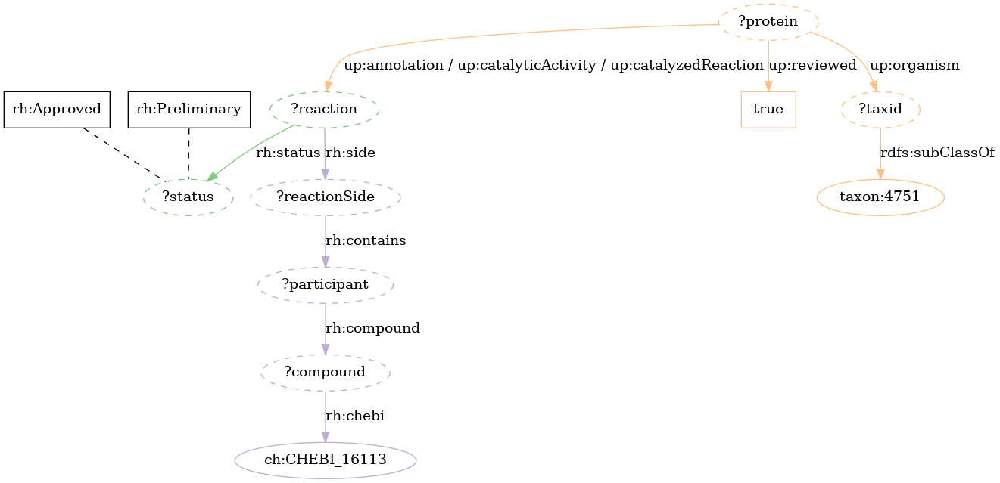

## Q8 : Where are the human enzymes metabolizing cholesterol located in the cell?

```sparql
PREFIX rdfs:<http://www.w3.org/2000/01/rdf-schema#>
PREFIX rh:<http://rdf.rhea-db.org/>
PREFIX ch:<http://purl.obolibrary.org/obo/>
PREFIX up:<http://purl.uniprot.org/core/>
PREFIX taxon:<http://purl.uniprot.org/taxonomy/>
PREFIX skos:<http://www.w3.org/2004/02/skos/core#>

SELECT distinct ?protein ?reaction
?upLocation ?upLocationLabel ?goId
WHERE {
    SERVICE <https://sparql.rhea-db.org/sparql> {
        ?reaction rdfs:subClassOf rh:Reaction .
        ?reaction rh:equation ?reactionEquation .
        ?reaction rh:side ?reactionSide .
        ?reactionSide rh:contains ?participant .
        ?participant rh:compound ?compound .
        ?compound rh:chebi ch:CHEBI_16113 .
    }
# Human proteins (taxid=9606)
?protein up:organism taxon:9606 .
# Rhea catalayzed reactions
?protein up:annotation ?a1 .
?a1 a up:Catalytic_Activity_Annotation .
?a1 up:catalyticActivity ?ca .
?ca up:catalyzedReaction ?reaction .
# UniProt cellular components
?protein up:annotation ?a2 .
?a2 a up:Subcellular_Location_Annotation .
?a2 up:locatedIn ?lIn .
?lIn up:cellularComponent ?upLocation .
?upLocation skos:prefLabel ?upLocationLabel .
?upLocation skos:exactMatch ?goId .
}
```

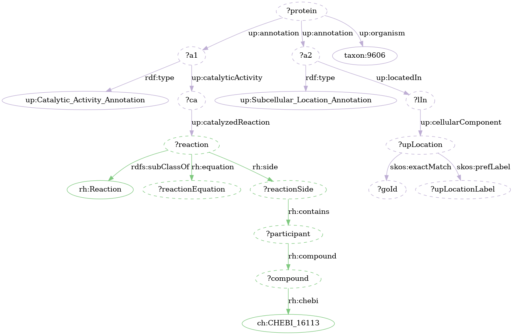

## Q9 : Where are the human genes encoding enzymes metabolizing cholesterol expressed?

```sparql
PREFIX rdfs:<http://www.w3.org/2000/01/rdf-schema#>
PREFIX rh:<http://rdf.rhea-db.org/>
PREFIX ch:<http://purl.obolibrary.org/obo/>
PREFIX up:<http://purl.uniprot.org/core/>
PREFIX taxon:<http://purl.uniprot.org/taxonomy/>
PREFIX genex: <http://purl.org/genex#>
PREFIX lscr: <http://purl.org/lscr#>

SELECT distinct ?protein ?ensemblGene ?reaction
?anatomicEntityLabel ?anatomicEntity
WHERE {
    SERVICE <https://sparql.rhea-db.org/sparql> {
        ?reaction rdfs:subClassOf rh:Reaction .
        ?reaction rh:equation ?reactionEquation .
        ?reaction rh:side ?reactionSide .
        ?reactionSide rh:contains ?participant .
        ?participant rh:compound ?compound .
        ?compound rh:chebi ch:CHEBI_16113 .
    }

    ?protein up:organism taxon:9606 .
    ?protein up:annotation ?a .
    ?a a up:Catalytic_Activity_Annotation .
    ?a up:catalyticActivity ?ca .
    ?ca up:catalyzedReaction ?reaction .
    ?protein rdfs:seeAlso / up:transcribedFrom ?ensemblGene .

    SERVICE <http://biosoda.expasy.org/rdf4j-server/repositories/bgeelight> {
        ?gene genex:isExpressedIn ?anatomicEntity .
        ?gene lscr:xrefEnsemblGene ?ensemblGene .
        ?anatomicEntity rdfs:label ?anatomicEntityLabel .
    }
}
```

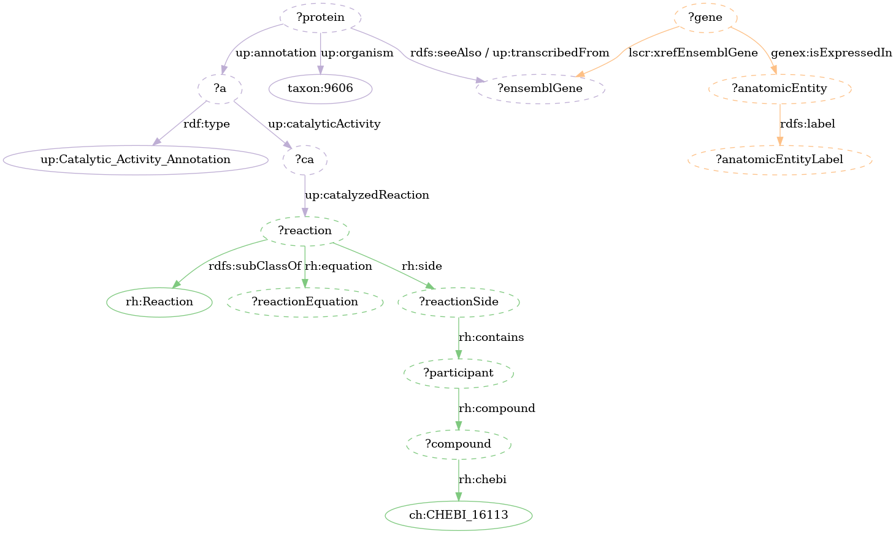

## Q10 :Build the UniProt H. pylori proteome scale metabolic network

```sparql
PREFIX rh:<http://rdf.rhea-db.org/>
PREFIX up:<http://purl.uniprot.org/core/>
PREFIX taxon:<http://purl.uniprot.org/taxonomy/>
SELECT ?protein ?proteinId
?reaction ?reactionSide
?compound ?chebi
?reactionEquation
WHERE {
    SERVICE <http://sparql.uniprot.org/sparql> {
        ?protein up:reviewed ?status .
        # Filter by NCBI taxid (H. pylori == 85962)
        ?protein up:organism taxon:85962 .
        ?protein up:mnemonic ?proteinId .
        # Rhea reactions catalyzed by UniProt proteins
        ?protein up:annotation ?a .
        ?a up:catalyticActivity ?ca .
        ?ca up:catalyzedReaction ?reaction .
    }
    ?reaction rh:equation ?reactionEquation .
    ?reaction rh:side ?reactionSide .
    ?reactionSide rh:contains ?participant .
    ?participant rh:compound ?compound .
    OPTIONAL {?compound rh:chebi ?chebi } .
}
```

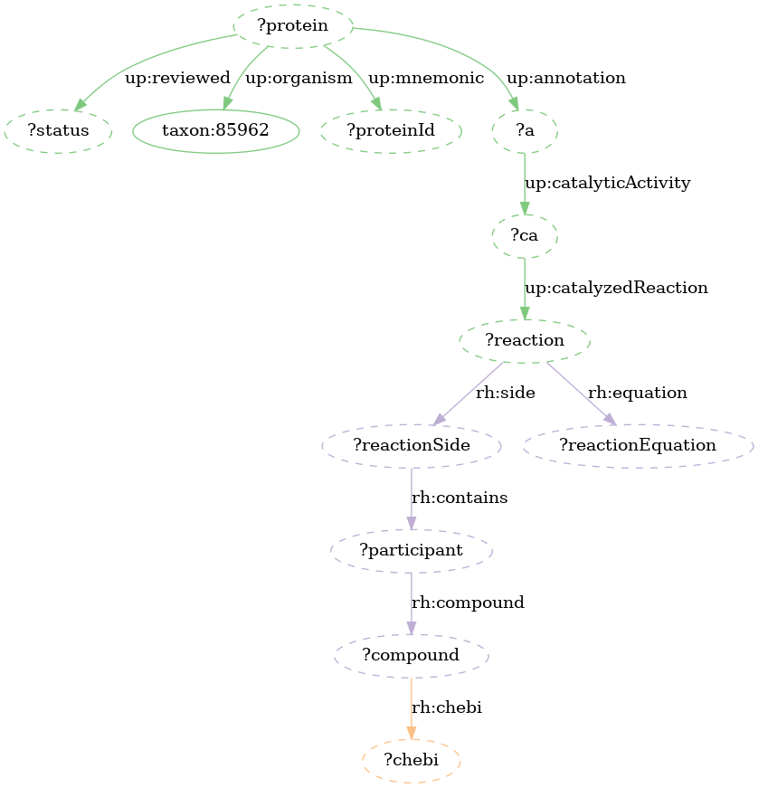

## Q11 : Explore H. pylori tryptophan biosynthesis pathway (GO:0000162)

```sparql
PREFIX rdfs:<http://www.w3.org/2000/01/rdf-schema#>
PREFIX up:<http://purl.uniprot.org/core/>
PREFIX rh:<http://rdf.rhea-db.org/>
PREFIX taxon:<http://purl.uniprot.org/taxonomy/>
PREFIX ch:<http://purl.obolibrary.org/obo/>
PREFIX GO:<http://purl.obolibrary.org/obo/GO>
SELECT distinct ?upProteinId ?goId ?rhReaction ?upPathway
WHERE{
    ?upProtein up:reviewed true .
    ?upProtein up:mnemonic ?upProteinId .
    # HELPY proteins (taxid=85962)

    ?upProtein up:organism taxon:85962 .
    ?upProtein up:annotation/up:catalyticActivity/up:catalyzedReaction ?rhReaction .
    ?upProtein up:classifiedWith ?goId .
    VALUES ?goId {GO:0000162} # GO: tryptophan biosynthesis
    OPTIONAL {
        ?upProtein up:annotation ?pa . # Pathway annotation
        ?pa a up:Pathway_Annotation .
        ?pa rdfs:seeAlso/rdfs:label ?upPathway . 
    }
}
ORDER BY ?upPathway
```

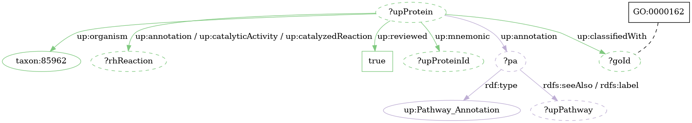

## Q12 : H. pylori enzyme complexes for tryptophan biosynthesis pathway (MetaNetX: seed_Opt85962_1)

```sparql
PREFIX rdfs:<http://www.w3.org/2000/01/rdf-schema#>
PREFIX up:<http://purl.uniprot.org/core/>
PREFIX rh:<http://rdf.rhea-db.org/>
PREFIX taxon:<http://purl.uniprot.org/taxonomy/>
PREFIX mnx:<https://rdf.metanetx.org/schema/>
PREFIX mnet:<https://rdf.metanetx.org/mnet/>
PREFIX GO:<http://purl.obolibrary.org/obo/GO_>

SELECT distinct ?upPathway ?upProteinId ?rhReaction
?mnxr ?cplx_label ?mnet
WHERE{
?upProtein up:reviewed true .
?upProtein up:mnemonic ?upProteinId .
?upProtein up:organism taxon:85962 .
?upProtein up:classifiedWith GO:0000162.
?upProtein up:annotation/up:catalyticActivity/up:catalyzedReaction ?rhReaction.
# Pathway annotation
OPTIONAL {?upProtein up:annotation ?pa.
?pa a up:Pathway_Annotation;
rdfs:seeAlso/rdfs:label ?upPathway . }
    SERVICE <https://rdf.metanetx.org/sparql> {
        ?mnxr mnx:reacXref ?rhReaction .
        ?reac mnx:mnxr ?mnxr .
        ?gpr mnx:reac ?reac .
        ?gpr mnx:cata ?cata .
        ?cata mnx:cplx ?cplx .
        ?cplx rdfs:label ?cplx_label .
        ?mnet mnx:gpr ?gpr .
        VALUES ?mnet {mnet:seed_Opt85962_1}
    }
}
ORDER BY ?upPathway
```

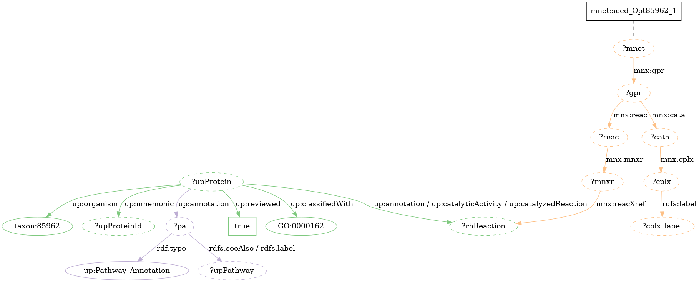